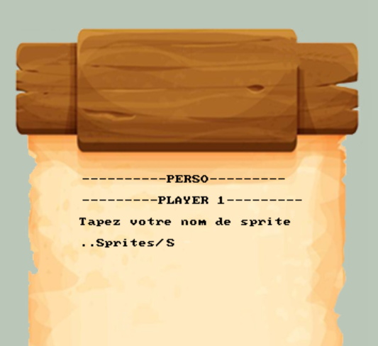

<script type="module">
  import mermaid from 'https://cdn.jsdelivr.net/npm/mermaid@10/dist/mermaid.esm.min.mjs';
    mermaid.initialize({ 
        startOnLoad: true,
        theme: 'base',
    });
</script>

<!--
# Style lead only for this slide
_class: lead
_footer: Algorithmique Avancée et Bibliothèque Graphique - 2022-2023
-->


**ING1** Projet d'informatique


# ECECOOKED S1/2

Grp 9 Equipe 1

---

# Grp9 Equipe 1
# 


---

# Sommaire
- Synthèse du sujet du projet ................................................................4
- Structures de données : schémas mémoire .....................................5
- Exigences fonctionnelles prioritaires .................................................7
- Diagramme fonctionnel .......................................................................11
- Exigences techniques de chaque fonctionnalité ..............................12
- Exigence technique de la modularité du code .................................23
- Fonctionnalités développées & Algorithmes ....................................25
- Répartition des tâches par fonctionnalités .......................................32
- GitHub ....................................................................................................33
- Bilan collectif .........................................................................................35
- Etudes documentaires (sources).........................................................36
- Tâches réalisées ....................................................................................37
- Investissement ......................................................................................38
- Code (annexe) .......................................................................................39

---

# Synthèse du sujet du projet
#

### :triangular_flag_on_post: ECECOOKED
#
# 

Le projet vise à développer un jeu vidéo de cuisine coopératif nommé **ECECOOKED**.
Les deux cuisiniers doivent récupérer, couper, cuire différents ingrédients pour ensuite les assembler et faire des plats.
L'objectif est de réaliser le maximum de plat dans un laps de temps très court. 
Les deux joueurs partagent un clavier ou des manettes pour contrôler leur personnage, interagir avec divers éléments de la cuisine comme des planches à découper ou des plaques de cuisson. 
Le jeu est graphique et comporte des effets sonores et musiques.


---

# Structures de données : schémas mémoire `1/2`

### Structures

<div class="mermaid">
%%{init: {'theme':'neutral'}}%%
classDiagram
    class t_player
    t_player : char username[25]
    t_player : BITMAP* imagejoueur
    t_player : BITMAP* sprite
    t_player : char name_sprite [50]
    t_player : double pos_milieux_X
    t_player : double pos_milieux_Y
    t_player : int pos_interaction_X
    t_player : int pos_interaction_Y
    t_player : int direction_angle
    t_player : int score

    class t_objet
    t_objet : int id_t_objet
    t_objet : int b_infranchissable

    class Background
    Background : BITMAP *background_back
    Background : BITMAP *background_front

    class t_terrain
    t_terrain : t_case meuble
    t_terrain : t_t_objet t_objet

    class t_case
    t_case : int typeElement
    t_case : int etat

    class t_t_objet
    t_t_objet : int assiette
    t_t_objet : int assiette sale
    t_t_objet : int steak
    t_t_objet : int steak cuit
    t_t_objet : int salade
    t_t_objet : ...


</div>

### Tableaux dynamique

- `char* name_sprite;`

---
# Structures de données : schémas mémoire `2/2`

### Graphe d'appel

<br>

<div class="mermaid">
%%{init: {'theme':'neutral'}}%%
flowchart LR
    main --> initialiser_Bitmap
    initialiser_Bitmap --> Creer_le_backgroung_back
    initialiser_Bitmap --> Creer_le_backgroung_front
    main --> initialiser_Sprite
    initialiser_Sprite --> alocation_tableau_dynamique
    alocation_tableau_dynamique --> nom_du_sprite_à_charger
    Creer_le_backgroung_back --> PLAY
    Creer_le_backgroung_front --> PLAY
    nom_du_sprite_à_charger --> PLAY
    PLAY --> Destroy_all_bitmap
    main --> alocation_tableau_dynamique2 --> charger_le_pseudo --> PLAY
</div>

---


# Exigences fonctionnelles prioritaires  `1/4`
#
- **EF1 : Le jeu doit toujours se jouer a exactement deux joueurs. Chaques joueurs à ses propres touches dédiés**
#
- **EF2 : Chaques joueurs doit pouvoir choisir son pseudo avant de commencer le jeu. Le pseudo sera affiché en jeu sur les joueurs et dans l'écran se score.**
#
- **EF3 : Les personnages des joueurs doivent pouvoir se déplacer a 360°. Le déplacement doit être fluide et intuitive.**


---


# Exigences fonctionnelles prioritaires  `2/4`
#
- **EF4 : Un niveau doit pouvoir se charger et se modifier simplement.**
#
- **EF5 : Une gestion des ingrédients dans le niveaux doit être fait pour stocker les  éléments, géré les différents conditions de combinaisons entre eux et l’utilisation des ustensiles.**
#
- **EF6 : Les joueurs doivent pouvoir interagir avec les objets en cuisine (ingrédients, assiettes, ustensiles). Ils doivent pouvoir les prendre, les poser, les combiné et pour les ustensiles, utiliser leurs fonction (planche a découper, plaque de cuisson).**
---


# Exigences fonctionnelles prioritaires  `3/4`
#
- **EF7 : Le jeu doit inclure un système de gestion des différentes commandes à préparer. Ces commandes peuvent êtres effectuer dans l’ordre souhaité. Le joueur devra les réaliser chaques commandes dans un temps imparti.**
#
- **EF8 : Le jeu doit calculer un score individuel des joueurs et un score d’équipe. Le score individuel se base sur les actions réalisées par le joueur (intentions entres les objets). Le score d’équipe se base sur les commandes réalisés, leurs durée pour les effectuées et la bonne composition du plat demandé. Le meilleur score d’équipe doit être sauvegardée**
#
- **EF9 : Un menu graphique doit être crée avec la possibilité de lancer une partie, regarder les meilleurs scores et les derniers scores, faire le réglage des paramètres et quitter le jeu. Les interactions doivent se faire avec des boutons clickable a la souris ou par une manette.**

---


# Exigences fonctionnelles prioritaires  `4/4`
#
- **EF10 : Des musiques et des bruitages doivent être implémenter dans le menu et durant les parties. Leurs réglages doit pouvoir se faire dans le menu ou en partie.**
#
- **EF11 : Une gestion du temps doit permettre de limiter la durée des niveau, de réaliser les commandes dans un durée imparti et de calculer le temps de cuisson des éléments cuisable.**

---

# Diagramme fonctionnel


---

# Exigences techniques `1/11`

#
- **EF1 : Le jeu doit toujours se jouer à exactement deux joueurs. Chaque joueur a ses propres touches dédiées.**
    #
    - ET1.1 : Le système doit être capable de détecter et d’agir en fonction des différentes touches pressé simultanément par les deux joueurs
    #
    - ET1.2 : Une vérification doit être mise en place au démarrage d'une partie pour s'assurer que deux joueurs sont bien présents et prêts à jouer.
---

# Exigences techniques `2/11`

#
- **EF2 : Chaque joueur doit pouvoir choisir son pseudo avant de commencer le jeu. Le pseudo sera affiché en jeu sur les joueurs et dans l'écran de score.**
    #
    - ET2.1 : Le jeu doit pouvoir choisir son pseudo avant le début de chaque partie.
    #
    - ET2.2 : Les pseudos doivent être stockés et accessibles pendant toute la durée de la partie pour affichage.
    #
    - ET2.3 : Une validation des pseudos est nécessaire pour éviter les caractères spéciaux non désirés.
    #
    - ET2.4 : Le système doit afficher dynamiquement les pseudos sur ou à proximité des avatars des joueurs en jeu.
    #
    - ET2.5 : Les pseudos doivent être inclus dans l'affichage des scores individuels et d'équipe.

---

# Exigences techniques `3/11`

#
- **EF3 : Les personnages des joueurs doivent pouvoir se déplacer à 360°. Le déplacement doit être fluide et intuitif.**
    #
    - ET3.1 : Implémenter une logique de déplacement basée sur un système avec la manette pour permettre un mouvement dans toutes les directions.
    #
    - ET3.3 : Un système de collision doit être implémenté pour gérer les interactions avec les éléments de l'environnement de jeu.
    #
    - ET3.5 : Le jeu doit gérer les entrées de  clavier et de manette.

---

# Exigences techniques `4/11`

#
- **EF4 : Un niveau doit pouvoir se charger et se modifier simplement.**
    #
    - ET4.1 : Chaque niveau doit être défini par un fichier de configuration externe qui décrit la disposition de la cuisine.
    #
    - ET4.2 : Le système doit comprendre générée le niveau a partir du fichier texte chargé.
    #
    - ET4.3 : Le jeu doit vérifier la bonne création du fichier.

---

# Exigences techniques `5/11`

#
- **EF5 : Une gestion des ingrédients dans le niveau doit être faite pour stocker les éléments, gérer les différentes conditions de combinaisons entre eux et l’utilisation des ustensiles.**
    #
    - ET5.1 : Implémenter une structure dictant les différents ingrédients existant et leurs composées.
    #
    - ET5.2 : Le système doit permettre l'ajout d'ingrédients à partir d'une configuration de niveau.
    #
    - ET5.3 : L’affichage des ingrédients doit être dynamique et ordonné pour pouvoir composer n’importe quel recette.
    #
    - ET5.4 : Les interactions avec les ustensiles (comme la plaque de cuisson ou le plan de travail) doivent modifier l'état des ingrédients de manière appropriée.

---

# Exigences techniques `6/11`

#
- **EF6 : Les joueurs doivent pouvoir interagir avec les objets en cuisine (ingrédients, assiettes, ustensiles). Ils doivent pouvoir les prendre, les poser, les combiner et, pour les ustensiles, utiliser leurs fonctions (planche à découper, plaque de cuisson).**
    #
    - ET6.1 : On doit pouvoir composer une recette a l’infini
    #
    - ET6.2 : Une logique de "prise et dépose" doit être implémentée pour permettre aux joueurs de manipuler les objets.
    #
    - ET6.3 : Chaque objet interactif doit avoir des actions spécifiques définies (ex : découper pour les planches à découper, cuire pour les plaques de cuisson) qui peuvent être activées par les joueurs.
    #
    - ET6.4 : Implémenter une interface utilisateur qui indique les actions possibles lorsque les joueurs se trouvent à proximité d'un objet interactif.
    #
    - ET6.5 : Un système de vérification de combinaisons d’ingrédients doit empêché les combinaisons interdites (steak cru,…).

---

# Exigences techniques `7/11`

#
- **EF7 : Le jeu doit inclure un système de gestion des différentes commandes à préparer. Ces commandes peuvent être effectuées dans l’ordre souhaité. Le joueur devra les réaliser chaque commande dans un temps imparti.**
    #
    - ET7.1 : Mettre en place une structure de données pour stocker les commandes actives, comprenant les ingrédients nécessaires et le temps imparti pour chaque commande.
    #
    - ET7.2 : Le système doit afficher en temps réel les commandes actives et le temps restant pour les compléter par une barre d'état.
    #
    - ET7.3 : Implémenter une logique de vérification pour identifier si une commande a été correctement préparée par les joueurs.
    #
    - ET7.4: En cas de bon recette d'une commande, le système doit la retirer de la liste active et ajuster le score des joueurs et de l'équipe.
    #
    - ET7.5 : Le jeu doit imposer un malus de score en cas d'échec à compléter une commande dans le temps imparti.

---

# Exigences techniques `8/11`

#
- **EF8 : Le jeu doit calculer un score individuel et un score d’équipe. Le meilleur score d’équipe doit être sauvegardé.**
    #
    - ET8.1 : Mettre en œuvre un système d’attribution des points pour les actions individuelles (ex : découper un ingrédient, cuire un aliment) et ajuste le score individuel de chaque joueur.
    #
    - ET8.2 : Mettre en œuvre un système d’attribution des points d’équipe basé sur les commandes complétées, en tenant compte du temps restant et de la bonne composition de la commande
    #
    - ET8.3 : Implémenter une fonction de sauvegarde des scores d’équipe pour chaque niveau, permettant de conserver un historique des meilleures performances.
    #
    - ET8.4 : Le jeu doit offrir un écran de fin de partie qui affiche les scores individuels et de l'équipe, ainsi que les meilleurs scores précédents pour comparaison.

---

# Exigences techniques `9/11`

#
- **EF9 : Un menu graphique doit être créé. Les interactions doivent se faire avec des boutons cliquables à la souris ou par une manette.**
    #
    - ET9.1 : Concevoir une interface utilisateur graphique pour le menu principal avec des boutons pour chaque action principale (jouer, scores, paramètres, quitter).
    #
    - ET9.2 : Le système doit être compatible avec les entrées souris et manette pour naviguer dans le menu et sélectionner les options.
    #
    - ET9.3 : Implémenter une section des paramètres permettant aux joueurs de personnaliser les commandes, le volume de la musique et des effets sonores.
    #
    - ET9.4 : Une fonctionnalité doit permettre d'afficher les meilleurs scores et les scores récents dans une interface dédiée.
    #
    - ET9.5 : Le menu doit offrir un accès facile pour démarrer une nouvelle partie, incluant la sélection du niveau et la saisie des pseudos des joueurs.

---

# Exigences techniques `10/11`

#
- **EF10 : Des musiques et des bruitages doivent être implémentés dans le menu et durant les parties. Leurs réglages doivent pouvoir se faire dans le menu ou en partie.**
    #
    - ET10.1 : Intégrer une musique de fond et des effets sonores en fonction des actions en jeu et dans les menus.
    #
    - ET10.2 : Le jeu doit permettre aux joueurs de régler le volume de la musique et des effets sonores séparément via le menu des paramètres.
    #
    - ET10.3 : Prévoir une bibliothèque d’effets sonores pour les différentes interactions en jeu (découpe, cuisson, prise d'objet, etc.).

---

# Exigences techniques `11/11`

#
- **EF11 : Une gestion du temps doit permettre de limiter la durée des niveaux, de réaliser les commandes dans une durée impartie et de calculer le temps de cuisson des éléments cuisables**.
    #
    - ET11.1 : Le système doit inclure un chronomètre pour chaque niveau, définissant la durée totale de la partie.
    #
    - ET11.2 : Implémenter des minuteries individuelles pour chaque commande, affichant le temps restant pour les compléter.
    #
    - ET11.3 : Un minuteur de cuisson Individuelle a chaque plaque de cuisson doit indiquer l’état de cuisson.
    #
    - ET11.4 : Des avertissements visuels et sonores doivent signaler aux joueurs l'approche de la fin du temps imparti pour le niveau, pour la préparation d'une commande ou pour une durée de cuisson trop longue.

---

# Exigence technique de la modularité du code
*Réalisée par : **Ethan B**, **Lucas V**.*

### :airplane: screen de mise en relation :
#


---

# Exigence technique de la modularité du code
*Réalisée par : **Ethan B**, **Lucas V**.*

### :airplane: schema de mise en relation :
#


---

# Fonctionalités Dev & Algo`1/3`
*Réalisée par : **Maxence H**, **Olivier Y**.*

### :wrench: Saisie des noms :
#
Avant de choisir un sprite, le joueur doit choisir un pseudo/nom d'utilisateur. Pour cela, le jeu lui demande de saisir un nom via le clavier.
Évidemment, le joueur a la possibilité de supprimer sa saisie lettre par lettre via la touche Backspace
:hourglass: Par la suite, pour l'intégration de la manette, nous devrons créer et afficher un clavier virtuel sur l'écran. 
:sos: En ce qui conserne les difficultés, allegro ne posède pas de fonction équivalente a scanf, donc on a dû la coder par nous même.


---

# Fonctionalités Dev & Algo `1/3`
*Réalisée par : **Maxence H**, **Olivier Y**.*

### :wrench: Saisie des noms :
#
Pour réaliser une fonction équivalente a scanf nous avons utilsé un tableau de caractères (de taille défini, 25 car le pseudo ne doit pas être trop long pour pouvoir l'afficher au dessus du personnage).

La fonction retourne la chaine de caractères si l'utilisateur appuie sur entrer ou si la chaine de caractères contient 25 caractères.


---

# Fonctionalités Dev & Algo `2/3`
*Réalisée par : **Maxence H**, **Olivier Y**.*

### :wrench: Choix des joueurs :
#
Pour choisir un joueur, nous avons opté pour une méhode simple et évolutive. Nous avons choisi de proposer des personages/skin au joueur via des images de ceux-ci.

Egalement, si le joueur le souhaite il peut appuyer sur le logo :heavy_plus_sign: pour accéder à l'option de personnalisation. Dans cette option il peut importer un sprite qu'il aura crée et personnalisé sur le site :
https://sanderfrenken.github.io/Universal-LPC-Spritesheet-Character-Generator.


---

# Fonctionalités Dev & Algo `2/3`

*Réalisée par : **Maxence H**, **Olivier Y**.*

### :wrench: Choix des joueurs :
#
Pour selectionner un joueur parmi la liste des personnages proposés nous avons utilisé notre sous-programme  ***bouton()***. Ce sous-programme renvoie 1 si le bouton qu'il affiche est cliqué grâce à systhème de coordonées sinon il revoie 0. 
Ainsi, si le joueur clique sur une image de personnage nous savons quelle image choisir.
Dans le deuxième cas, si le joueur veut importer son propre personnage en cliquant sur le bouton plus. Là le programme crée un tbaleau dynamique qui stocke le nom du fichier.BMP. Si celui-ci est lisible, alors le personnage est chargé. Sinon, le programme redemande à l'utilisateur de taper le chemin d'accès.

:hourglass: Par la suite, nous aimerions afficher le nouveau joueur dans la liste des joueurs proposé.

---

# Fonctionalités Dev & Algo `3/3`

*Réalisée par : **Maxence H**, **Ethan B**.*

### :wrench: Deplacements :
#
Le mouvement des personnages doit pouvoir se faire a 360 degrés en simulatné.
L'un des personnage se déplace avec les flèches du clavier et un autre se deplace avec les touches ZQSD.
Les deux perssonages peuvent egalement etre relié à une manette (Xbox ou PS) à la place des touches du clavier.

:hourglass: Par la suite, l'ideal serait d'animer un model 3D de nos perssonages pour profiter pleinement de la rotation à 360 degrés.


---

# Fonctionalités Dev & Algo `3/3`

*Réalisée par : **Maxence H**, **Ethan B**.*

### :wrench: Deplacements :

Pour le mouvement, l'objectif a été de créer une donnée utile plutôt que de devoir faire un switch case à chaque appel de la fonction. 
Suite à un long cheminement on en a conclu que la meilleure facon de gérer les déplacements était de créer une variable direction qui prenait une valeur entre 0 et 360 degrés. Ainsi, le personnage peut véritablement se deplacer à 360 degrés (c'est encore plus important avec la manette).
Pour calculer cet angle de rotation on utilise la fonction ***atan2()*** depuis la librairie maths import, elle fonctionne un peu comme le calcul d'un coefficient directeur.
De plus, pour restreindre ses depacements (il ne peut pas sauter au dessus d'un plan de travail) on a réfléchit à la meilleure façon de faire. 
Nous sommes partis sur un algorithme de calcul de hit box circulaire ***(méthode Bresenham)***. Passer par les hit box plutôt que regarder si les bitmaps sont superposés, permet d'avoir un personnage qui peut se coller dans les coins.

---

# Fonctionalités Dev & Algo `3/3`

*Réalisée par : **Maxence H**, **Ethan B**.*

### :wrench: Deplacements :
#
Logigramme du sous-programme mouvement en simplifié. 


---

# Répartition des tâches par fonctionnalités
### :clock2: Notion/outils de gestion de projet :
#


---

# GitHub : projet-allegro-ing1-2023-2024-s2-ececooked-ing1-2023-2024-9-1 `1/2`
https://github.com/ING1-Paris/projet-allegro-ing1-2023-2024-s2-ececooked-ing1-2023-2024-9-1

#
Durant le développement, nous avons parfois travaillé ensemble sur un seul PC, en présentiel ou en session partagée sur CLion, donc certains commits sont au nom d'une seule personne mais sont enfaite le fruit d'un travail commun. 
:exclamation: <b>Les commits ne sont donc pas représentatifs de travail commun.</b>

---

# GitHub : projet-allegro-ing1-2023-2024-s2-ececooked-ing1-2023-2024-9-1 `2/2`
#


---

# Bilan collectif
Ce projet nous à tous demandé d’utiliser des nouvelles compétences informatiques comme Allegro. En effet nous nous sommes tous fortement impliqué dans ce projet, de ce fait nous avons pu améliorer notre niveau, surtout dans ces nouvelles notions.
Egalement, comparé aux anciens projets, nous avons mieux réfléchi par où commencer et comment procéder, ce qui nous a aidé à planifier les choses plus facilement. Nous nous sommes bien organisés ce qui nous a permis de développer notre jeu plutôt rapidement, nous avons déjà tout le menu, quelques musiques et enfin les bases des niveaux fonctionnels. 
Pour finir nous aimons travailler sur ce projet car le jeu attendu est beaucoup plus complet que le précédent : Snoopy, on se rapproche de la création d’un jeu moderne. Notre travail donnera naissance à quelque chose de beaucoup plus abouti ce qui nous motive grandement.

---

# Etudes documentaires (sources)
#

- PowerPoint de l'ECE sur les bitmaps et l'utilisation d'Allegro.
- Exemples de code sur Boostcamp.
- Site officiel d'Allegro (pour les effets de transparence etc...).
- Site officiel d'Allegro pour regarder des exemples de jeux.
- Blog et video pour l'utilisation de la manette.
- GitHub des exemples des fonctions de <maths.h>.
- Site pour créer des bitmaps : https://sanderfrenken.github.io/Universal-LPC-Spritesheet-Character-Generator.

---

## Tâches réalisées
#
- `✅ 100%` Mouvement des deux personnages
- `✅ 90% ` Menu ()
    - *manque les details des bitmaps & manque une belle interface de chargement.*
- `✅ 90% ` Sous-programme chargement du background des niveaux
    - *il y a eu des recents changements sur ce sous-programme avec isometrie nous attendons d'être sur qu'il n'y aura pas d'autres changements.*
- `✅ 80% ` bitmaps aliments et assiettes
- `❌ 30%` Niveaux avec leurs thèmes
    - *Nous attendons d'avoir le sous-programme de chargement 100% validé avant de commencer les thèmes.*
- `❌ 10%` Musiques et sons 
    - *Musique d'intro implémentée (avec option ON/OFF), mais les autres sons et musiques arriverons pendant le développement des niveaux.*

---

# Investissement

Diagramme d'investissement dans le projet avec les DS.

<div class="mermaid">
%%{init: {'theme':'neutral'}}%%
pie showData
    "Olivier Y" : 25
    "Lucas V" : 17
    "Ethan B" : 25
    "Maxence H" : 33
</div>

---

# Code (annexe) `1/3`
#
### Fonction 1 code pour le scanf() :
#
```C
int j=0;
    while ((!key[KEY_ENTER] && state[BUTTON_X]!=1) && j < 50){  //todo faire un clavier virtuelle pour la manette
        input(state);
        if(keypressed()){
            int KEY = readkey();
            if((KEY>>8==KEY_DEL || KEY>>8==KEY_BACKSPACE) && j>0){
                j-=1;
                string[j]=' ';
            }else if(KEY>>8){
                string[j]=KEY;
                j++;
            }
        }
        blit(maptexte2,buferdetexte,0,0,0,0,SCREEN_W,SCREEN_H);
        textprintf_ex(buferdetexte, font, SCREEN_W - 220, 260, makecol(0, 0, 0), -1,string );
        blit(buferdetexte,screen,0,0,0,0,SCREEN_W,SCREEN_H);
    }
```
---

# Code (annexe) `2/3`
#
### Fonction 2 code pour le choix des personnages :
#
```C
strcat(joueur1.name_sprite,"../Images/Sprites/");
    strcat(joueur1.name_sprite,string);
    //cas rapide par defaut
    if(strcmp(joueur1.name_sprite,"../Images/Sprites/")==0){
        strcat(joueur1.name_sprite,"joueur1.bmp");
        joueur1.imagejoueur= load_bitmap(joueur1.name_sprite,NULL); //choix du skin
        assert(joueur1.imagejoueur!=NULL);
    }else{
        joueur1.imagejoueur= load_bitmap(joueur1.name_sprite,NULL); //choix du skin
        assert(joueur1.imagejoueur!=NULL);
    }
```

---

# Code (annexe) `3/3`
#
### Fonction 3 analyse de hit box :
#
```C
void calculHitBox(t_player *joueur,double* previuscoY,double* previuscoX , t_objet matrice[NB_LIGNES][NB_COLONNES]){ //pris sur un salon sur l analyse des hit box et la creation des cercle methode Bresenham
    int x0 = (int)joueur->pos_milieux_X;  int y0 = (int)joueur->pos_milieux_Y;
    int x = (joueur->sprite->w-2)/2; //attention le -5 car immage mal ronier
    int y = 0;
    int err = 0;
// 1 = obstacles structure type obj = 2 6 etc table etc et blocage = 1 ou 0
    while (x >= y) {
        // a 100 detailler pour faire des slides en desinchronisant les coordonée x et y
        if(matrice[(y0+y)/70][(x0+x)/70].b_infranchissable == 1){joueur->pos_milieux_Y = *previuscoY; joueur->pos_milieux_X = *previuscoX;}
        else if(matrice[(y0+y)/70][(x0+x)/70].b_infranchissable == 1){joueur->pos_milieux_Y = *previuscoY; joueur->pos_milieux_X = *previuscoX;}
        else if(matrice[(y0+x)/70][(x0+y)/70].b_infranchissable == 1){joueur->pos_milieux_Y = *previuscoY; joueur->pos_milieux_X = *previuscoX;}
        else if(matrice[(y0+x)/70][(x0-y)/70].b_infranchissable == 1){joueur->pos_milieux_Y = *previuscoY; joueur->pos_milieux_X = *previuscoX;}
        else if(matrice[(y0+y)/70][(x0-x)/70].b_infranchissable == 1){joueur->pos_milieux_Y = *previuscoY; joueur->pos_milieux_X = *previuscoX;}
        else if(matrice[(y0-y)/70][(x0-x)/70].b_infranchissable == 1){joueur->pos_milieux_Y = *previuscoY; joueur->pos_milieux_X = *previuscoX;}
        else if(matrice[(y0-x)/70][(x0-y)/70].b_infranchissable == 1){joueur->pos_milieux_Y = *previuscoY; joueur->pos_milieux_X = *previuscoX;}
        else if(matrice[(y0-x)/70][(x0+y)/70].b_infranchissable == 1){joueur->pos_milieux_Y = *previuscoY; joueur->pos_milieux_X = *previuscoX;}
        else if(matrice[(y0-y)/70][(x0+x)/70].b_infranchissable == 1){joueur->pos_milieux_Y = *previuscoY; joueur->pos_milieux_X = *previuscoX;}
        if (err <= 0) {
            y += 1;
            err += 2*y + 1;
        }
        if (err > 0) {
            x -= 1;
            err -= 2*x + 1;
        }
    }
}
```

---

# Code (annexe) `3/3`
#
### Fonction 3 calcul de l'angle avec des deltas de coordonées :

```C
if (previuscoY_J2 != joueur2->pos_milieux_Y || previuscoX_J2 != joueur2->pos_milieux_X) {
        double deltaY2 = joueur2->pos_milieux_Y - previuscoY_J2;
        double deltaX2 = joueur2->pos_milieux_X - previuscoX_J2;
        // fonction de maths.h permetant le calcul d'un angle (en radians) entre les deux vecteurs et pas division par 0 !
        double angle2 = atan2(deltaY2, deltaX2);
        joueur2->direction_angle =(int)(angle2 * 180.0 / M_PI)+90;
    }
```

